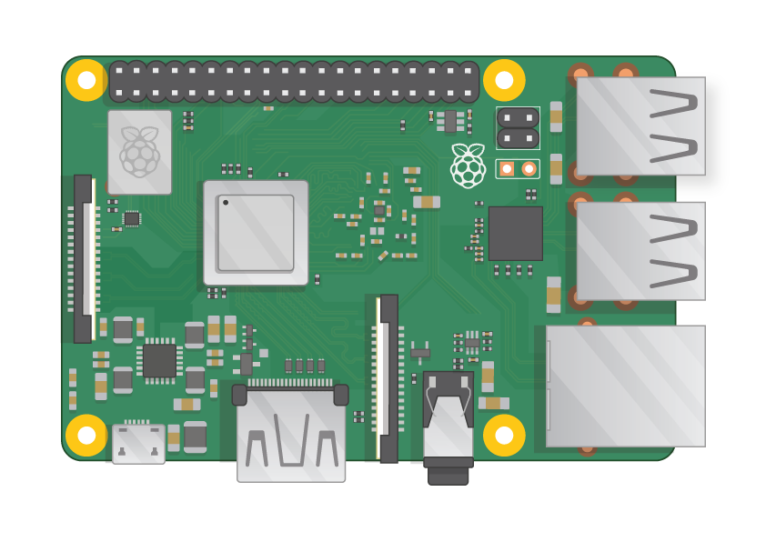
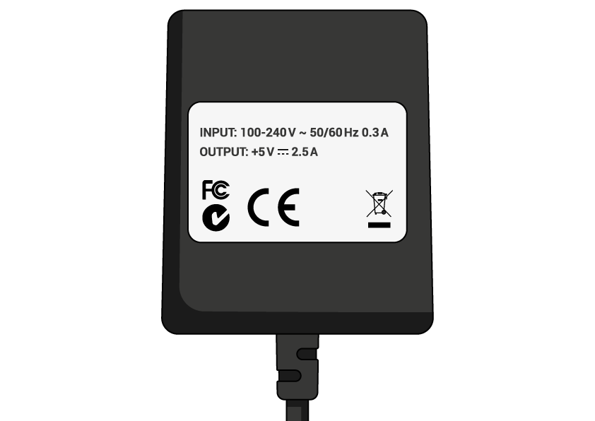

## Kaj boste potrebovali

### Katera malina Pi?

Obstaja več [modelov Raspberry Pi](https://www.raspberrypi.org/products/), in za večino ljudi je izbira Raspberry Pi 3 Model B +.

Raspberry Pi 3 Model B + je najnovejši, najhitrejši in najlažji za uporabo.

Raspberry Pi Zero in Zero W so manjši in zahtevajo manj moči, zato so uporabni za prenosne projekte, kot so roboti. Na splošno je lažje začeti projekt z Raspberry Pi 3 in se premakniti v Pi Zero, če imate delovni prototip, za katerega bi bil koristnejši manjši Pi.

Če želite kupiti Raspberry Pi, pojdite na [rpf.io/products](https://rpf.io/products).

### Napajanje

Za priključitev na električno vtičnico ima Raspberry Pi mikro USB-priključek (isti najdeni, ki ga najdemo na številnih mobilnih telefonih).

Potrebovali boste napajanje, ki zagotavlja vsaj 2,5 ampera. Priporočamo, da uporabite [uradno napajalno napravo Raspberry Pi](https://www.raspberrypi.org/products/raspberry-pi-universal-power-supply/).

### Micro SD kartica

Vaš Raspberry Pi potrebuje SD kartico za shranjevanje vseh datotek in operacijskega sistema Raspbian.

Potrebovali boste micro SD kartico z zmogljivostjo najmanj 8 GB.

Mnogi prodajalci dobavljajo SD kartice za Raspberry Pi, ki so že nameščeni z Raspbian in so pripravljeni na odhod.

### Tipkovnica in miška

Če želite začeti uporabljati vašo malino, potrebujete USB-tipkovnico in miško USB.

Ko nastavite svoj Pi, lahko uporabite tipkovnico Bluetooth in miško, za namestitev pa potrebujete tipkovnico USB in miško.

### TV ali računalniški zaslon

Če si želite ogledati okolje Raspbian namizja, boste potrebovali zaslon in kabel za povezavo zaslona in Pi. Zaslon je lahko TV ali računalniški monitor. Če ima zaslon vgrajene zvočnike, jih bo lahko uporabil za predvajanje zvoka.

#### HDMI

Raspberry Pi ima HDMI izhodno pristanišče, ki je združljivo s pristaniščem HDMI večine sodobnih televizorjev in računalniških monitorjev. Mnogi računalniški monitorji imajo lahko tudi vrata DVI ali VGA.

#### DVI

Če ima vaš zaslon DVI vrata, jo lahko povežete s pomočjo kabla HDMI-DVI.

#### VGA

Nekateri zasloni imajo samo vrata VGA.

Če želite povezati svoj Pi s takim zaslonom, lahko uporabite adapter HDMI-to-VGA.

### Dodatni dodatki

#### Primer

Morda boste želeli postaviti vašega Raspberry Pi v primer. To ni nujno, vendar bo zagotovilo zaščito vašega Pi. Če želite, lahko uporabite uradni primer za [Raspberry Pi 3](https://www.raspberrypi.org/products/raspberry-pi-3-case/) ali [Pi Zero ali Zero W](https://www.raspberrypi.org/products/raspberry-pi-zero-case/).

#### Slušalke ali zvočniki

Veliki modeli Raspberry Pi (ne Pi Zero / Zero W) imajo standardno avdio priključek, podobno kot pri vašem pametnem telefonu ali MP3 predvajalniku. Če želite, lahko priključite slušalke ali zvočnike, tako da lahko Pi predvaja zvok. Če zaslon, ki ga povežete z Pi, ima vgrajene zvočnike, lahko Pi igra predvajanje zvoka.

#### Ethernet kabel

Veliki modeli Raspberry Pi (ne Pi Zero / Zero W) imajo standardno vrata Ethernet, ki jih lahko povežete z internetom. Če želite priključiti Pi Zero na internet, potrebujete adapter USB-to-Ethernet. Raspberry Pi 3 in Pi Zero W sta tudi brezžično povezana s spletom.