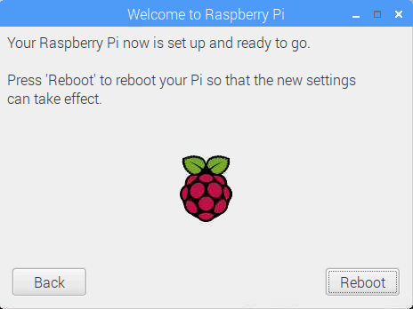

## Končajte nastavitev

Ko prvič zaženete Raspberry Pi, se bo **Welcome to Application Raspberry Pi** pojavilo in vas vodilo skozi začetno nastavitev.

+ Če želite začeti nastavitev, kliknite **Naprej**.

+ Nastavite **Država**, **jezik**in **časovni pas**, nato **Naprej** znova.

+ Vnesite novo geslo za vašo Raspberry Pi in kliknite **Naprej**.

+ Povežite se z omrežjem WiFi tako, da izberete njegovo ime, vnesete geslo in kliknete **Naprej**.

**Opomba:** če vaš model Raspberry Pi nima brezžične povezave, tega zaslona ne boste videli.

+ Kliknite **Naprej** čarovnik preveri, ali so posodobitve na voljo v programu Raspbian in jih namestite (to lahko traja nekaj časa).

+ Kliknite **Končano** ali **Ponovite** da končate nastavitev.

**Opomba:** boste morali ponovno zagnati le, če je to potrebno za dokončanje posodobitve.

