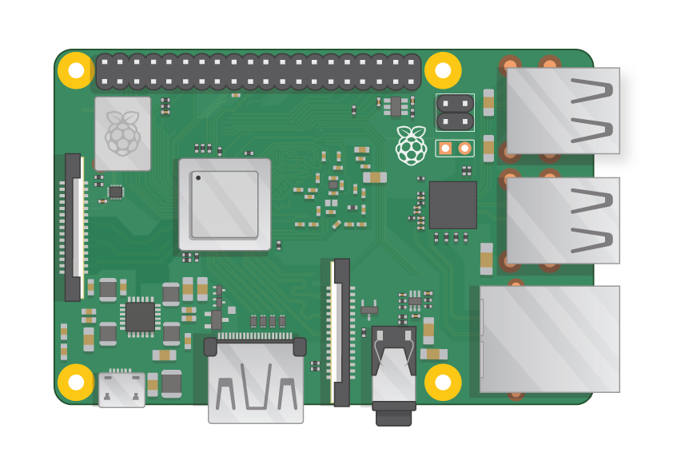

## Neye ihtiyacınız olacak?

### Hangi Ahududu Pi?

Raspberry Pi</a>birçok modeli vardır ve çoğu insan için Raspberry Pi 3 Model B + seçenektir.
 

Raspberry Pi 3 Model B +, en yeni, en hızlı ve kullanımı en kolay olanıdır.

Raspberry Pi Zero ve Zero W daha küçüktür ve daha az güç gerektirir, böylece robotlar gibi portatif projeler için faydalıdırlar. Raspberry Pi 3 ile bir projeye başlamak daha kolaydır ve daha küçük Pi'nin işe yarayacağı bir çalışma prototipine sahip olduğunuzda Pi Zero'ya geçmeniz daha kolaydır.

Bir Raspberry Pi satın almak istiyorsanız, [rpf.io/products](https://rpf.io/products)adresine gidin.

### Bir güç kaynağı

Bir elektrik prizine bağlanmak için, Raspberry Pi'nin bir mikro USB bağlantı noktası vardır (aynı birçok cep telefonunda bulunur).

En az 2.5 amperlik bir güç kaynağına ihtiyacınız olacaktır. [resmi Raspberry Pi güç kaynağını](https://www.raspberrypi.org/products/raspberry-pi-universal-power-supply/)kullanmanızı öneririz.

### Bir micro SD kart

Raspberry Pi'niz, tüm dosyalarını ve Raspbian işletim sistemini saklamak için bir SD karta ihtiyaç duyar.

En az 8 GB kapasiteli bir micro SD kart gerekir.

Birçok satıcı Raspberry Pi için zaten Raspbian ile kurulmuş olan ve gitmeye hazır SD kartlar sağlıyor.

### Bir klavye ve fare

Ahududu'nuzu kullanmaya başlamak için, bir USB klavyeye ve bir USB fareye ihtiyacınız olacak.

Pi'nizi ayarladıktan sonra, bir Bluetooth klavye ve fare kullanabilirsiniz, ancak kurulum için bir USB klavye ve fare gerekir.

### TV veya bilgisayar ekranı

Raspbian masaüstü ortamını görüntülemek için, ekranı ve Pi'yi bağlamak için bir ekran ve bir kabloya ihtiyacınız olacak. Ekran bir TV veya bilgisayar monitörü olabilir. Ekranda yerleşik hoparlörler varsa, Pi bunları çalmak için bunları kullanabilecektir.

#### HDMI

Raspberry Pi'nin en modern TV'lerin ve bilgisayar monitörlerinin HDMI portu ile uyumlu bir HDMI çıkış portu vardır. Birçok bilgisayar monitöründe ayrıca DVI veya VGA bağlantı noktaları olabilir.

#### DVI

Ekranınızda bir DVI portu varsa, bir HDMI-DVI kablosu kullanarak Pi'ye bağlayabilirsiniz.

#### VGA

Bazı ekranlarda sadece bir VGA bağlantı noktası vardır.

Pi'nizi böyle bir ekrana bağlamak için, HDMI-VGA adaptörünü kullanabilirsiniz.

### İsteğe bağlı ekstralar

#### Bir dava

Ahududu Pi'nizi bir kutuya koymak isteyebilirsiniz. Bu gerekli değildir, ama Pi'niz için koruma sağlayacaktır. İsterseniz, [Raspberry Pi 3](https://www.raspberrypi.org/products/raspberry-pi-3-case/) veya [Pi Zero veya Zero W](https://www.raspberrypi.org/products/raspberry-pi-zero-case/)için resmi davayı kullanabilirsiniz.

#### Kulaklık veya hoparlörler

Büyük Raspberry Pi modelleri (Pi Zero / Zero W değil), akıllı telefonunuzdaki veya MP3 çalarınızdaki gibi standart bir ses portuna sahiptir. İsterseniz, kulaklıklarınızı veya hoparlörlerinizi Pi'nin ses çalabilmesi için bağlayabilirsiniz. Pi'nizi bağladığınız ekran dahili hoparlörlere sahipse, Pi bunlardan ses çalabilir.

#### Bir Ethernet kablosu

Büyük Raspberry Pi modelleri (Pi Zero / Zero W değil), onları internete bağlamak için standart bir Ethernet portuna sahiptir. Bir Pi Zero'yu internete bağlamak için bir USB-Ethernet adaptörüne ihtiyacınız var. Raspberry Pi 3 ve Pi Zero W da internete kablosuz olarak bağlanabilir.