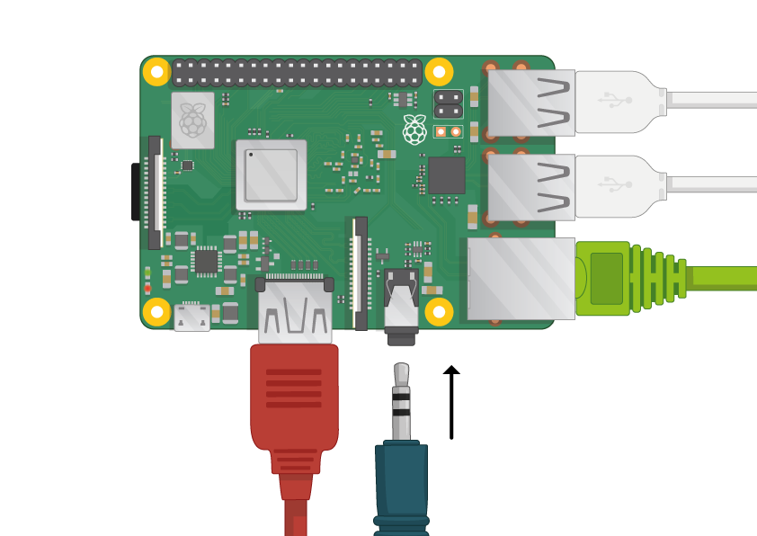

## Ahududu Pi'nizi bağlayın

Hadi her şeyi birbirine bağlayalım. Bunu doğru sırada yapmak önemlidir, böylece tüm bileşenleriniz güvende olur.

+ Raspbian ile oluşturduğunuz SD kartını (NOOBS aracılığıyla) Pi'nizin alt tarafındaki micro SD kart yuvasına takın. 

**Not:** Çok sayıda mikro SD kart daha büyük bir adaptörün içine girecektir - kartı alt kısımdaki dudağı kullanarak kaydırabilirsiniz.

+ Fareniz için USB kablosunu bulun ve fareyi Raspberry Pi'deki bir USB portuna bağlayın (hangisi önemli değil).

+ Klavyeyi aynı şekilde bağlayın.

+ Raspberry Pi'deki HDMI portuna bakın - üstte büyük, düz bir tarafa sahip olduğuna dikkat edin.

+ Ekranınızın bir duvar prizine takılı ve açık olduğundan emin olun. Ekranı Pi'nin HDMI bağlantı noktasına bağlamak için bir kablo kullanın - gerekirse bir adaptör kullanın.

**Not:** Pi ekranda çalışmadığı için ekranda hiçbir şey görüntülenmeyecektir.

+ Pi'yi Ethernet üzerinden internete bağlamak isterseniz, Raspberry Pi üzerindeki Ethernet portunu duvardaki veya internet yönlendiricinizdeki bir Ethernet soketine bağlamak için bir Ethernet kablosu kullanın. WiFi kullanacaksanız veya internete bağlanmak istemiyorsanız bunu yapmanız gerekmez.

+ Hoparlörler varsa, sesiniz ekranınızdan gelecektir ya da varsa ses jakına kulaklık veya hoparlör bağlayabilirsiniz.

