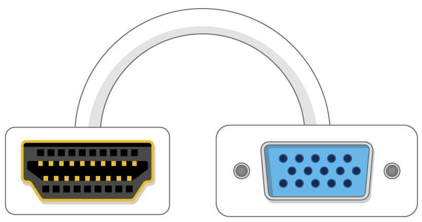

## Що вам знадобиться

### Яка Малина Пі?

Є декілька [моделей малини Пі](https://www.raspberrypi.org/products/), а для більшості людей - Малина Пі 3 Модель B +.

Raspberry Pi 3 Модель B + - це найновіша, найшвидша та найпростіша у використанні.

Малинка Pi Zero і Zero W менше і вимагають меншої потужності, тому вони корисні для портативних проектів, таких як роботів. Як правило, простіше запустити проект з Малина Пі 3, і перейти до Пі Зеро, коли у вас є робочий прототип, який може бути корисним для меншого Пі.

Якщо ви хочете придбати Малина Пі, перейдіть до [rpf.io/products](https://rpf.io/products).

### Блок живлення

Для підключення до розетки живлення малина має мікро-порт USB (такий же, що знайдено на багатьох мобільних телефонах).

Вам знадобиться джерело живлення, що забезпечує принаймні 2,5 амперу. Ми рекомендуємо використовувати [офіційного джерела енергії "Малина Пі"](https://www.raspberrypi.org/products/raspberry-pi-universal-power-supply/).

### Картка мікро-SD

Ваш Raspberry Pi потребує SD-карти для зберігання всіх його файлів та операційної системи Raspbian.

Вам знадобиться картка micro SD, місткість щонайменше 8 Гб.

Багато продавців постачають SD-карти для Raspberry Pi, які вже встановлені з Raspbian і готові піти.

### Клавіатура та миша

Щоб почати користуватися вашою малиною, вам знадобляться USB-клавіатура та USB-миша.

Після того як ви встановили свій Pi, ви можете використовувати клавіатуру Bluetooth і мишу, але для налаштування потрібна клавіатура USB та миша.

### Телевізор або комп'ютерний екран

Щоб переглянути робоче середовище Raspbian, вам буде потрібно екран та кабель для зв'язку екрану та Pi. Екран може бути телевізором або монітором комп'ютера. Якщо на екрані є вбудовані динаміки, Pi зможе використовувати їх для відтворення звуку.

#### HDMI

Raspberry Pi має вихідний порт HDMI, сумісний з портом HDMI більшості сучасних телевізорів та комп'ютерних моніторів. Багато комп'ютерних моніторів також можуть мати DVI або VGA-порти.

#### DVI

Якщо ваш екран має порт DVI, ви можете підключити Pi до нього за допомогою кабелю HDMI-to-DVI.

#### VGA

У деяких екранах є порт VGA.

Щоб підключити свій Pi до такого екрану, ви можете використовувати адаптер HDMI-to-VGA.

### Додаткові додаткові послуги

#### Випадок

Ви можете поставити свою малину Пі в справу. Це не є суттєвим, але це забезпечить захист для вашого Pi. Якщо ви хочете, ви можете скористатися офіційною версією для [Raspberry Pi 3](https://www.raspberrypi.org/products/raspberry-pi-3-case/) або [Pi Zero або Zero W](https://www.raspberrypi.org/products/raspberry-pi-zero-case/).

#### Навушники або динаміки

Великі моделі малини Пі (а не Pi Zero / Zero W) мають стандартний аудіопорт, подібний до вашого смартфона або MP3-плеєра. Якщо ви хочете, ви можете підключити навушники або динаміки так, щоб Pi міг відтворити звук. Якщо на екрані, з яким ви з'єднуєте свій Pi з вбудованими динаміками, Pi може відтворити звук через ці.

#### Кабель Ethernet

Великі моделі Raspberry Pi (а не Pi Zero / Zero W) мають стандартний порт Ethernet для підключення їх до Інтернету. Щоб підключити Pi Zero до Інтернету, вам потрібен адаптер USB-to-Ethernet. Малина Пі 3 і Пі Зеро W також можуть бути бездротовими підключеними до Інтернету.