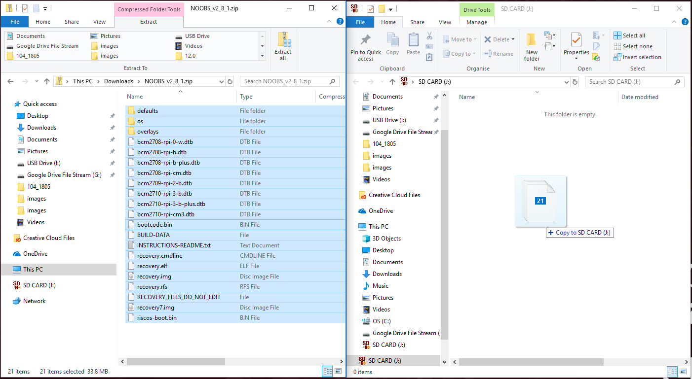
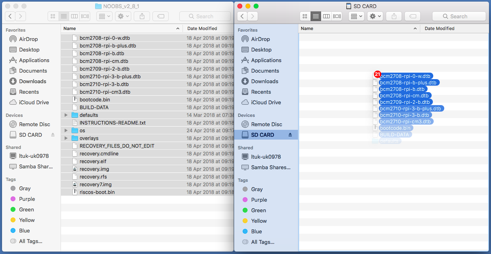

## Налаштуйте SD-карту

Якщо у вас є SD-карта, на якій ще немає операційної системи Raspbian, або якщо ви хочете скинути свою малину, Ви можете легко встановити Raspbian самостійно. Для цього потрібен комп'ютер із портом SD-карти - більшість ноутбуків і настільних комп'ютерів мають один.

### Операційна система Raspbian через NOOBS

Використання програмного забезпечення NOOBS - найпростіший спосіб встановлення Raspbian на SD-карту.

#### Завантажити NOOBS

+ Відвідайте сторінку " [Малина Пі" сторінка](https://www.raspberrypi.org/downloads).

+ Ви повинні побачити поле, що посилається на файли NOOBS. Натисніть на коробку.

+ Найпростішим варіантом є завантаження архіву архівів файлів. Обов'язково зверніть увагу на те, де ви зберігаєте архів, щоб швидко його знайти.

#### Форматуйте SD-карту

Все, що зберігається на картці SD, буде перезаписано під час форматування. Отже, якщо SD-карта, на якій ви хочете встановити Raspbian, наразі має на ньому будь-які файли, наприклад, з більш старої версії програми Raspbian, то, можливо, вам слід спочатку повернути ці файли, щоб вони не втрачали їх назавжди.

+ Відвідайте веб-сайт асоціації SD і завантажте [SD Formatter 4.0](https://www.sdcard.org/downloads/formatter_4/index.html) для Windows або Mac.

+ Дотримуйтесь інструкцій, щоб встановити програмне забезпечення.

+ Вставте SD-карту в гніздо для картки SD на комп'ютері або на ноутбуці та помістіть на нього букву диска, наприклад, `F: /`.

+ У SD Formatter виберіть букву диска для вашої SD-карти та формат картки.

#### Вилучіть NOOBS з архіву zip

Далі вам доведеться витягнути файли з ZIP архіву NOOBS, завантаженого з веб-сайту Raspberry Pi.

+ Знайдіть завантажений архів - за замовчуванням він має бути у вашій папці `завантажень`.

+ Двічі клацніть на ньому, щоб витягнути файли, і збережіть відкрите вікно Explorer / Finder.

#### Скопіюйте файли

+ Тепер відкрийте інше вікно Explorer / Finder та перейдіть на SD-карту. Найкраще розташувати обидва вікна пліч-о-пліч.

+ Виберіть усі файли в папці `NOOBS` та перетягніть їх у вікно SD-карти, щоб скопіювати їх на карту.

+ Після того, як усі файли були скопійовані, ви можете вийняти SD-карту.