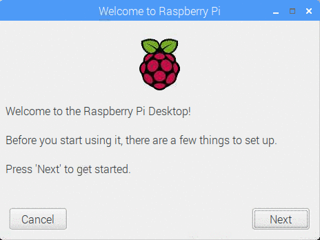

## Завершіть налаштування

Коли ви вперше запустите малину Пі, програма **Welcome to Raspberry Pi** з'явиться та відкриє вам початкову настройку.

+ Клацніть **Далі** щоб розпочати налаштування.

+ Встановіть **Country**, **Language**і **Timezone**, потім ще раз натисніть **Next**.

+ Введіть новий пароль для Вашої Малини Пі та натисніть **Далі**.

+ Підключіться до вашої мережі Wi-Fi, вибравши його ім'я, ввівши пароль і натиснувши **Далі**.

**Примітка:** якщо у моделі Raspberry Pi немає бездротового з'єднання, цей екран не відображатиметься.

+ Клацніть **Далі** дозвольте майстру перевірити наявність оновлень Raspbian та встановити їх (це може зайняти деякий час).

+ Клацніть **Готово** або **Перезавантажте** щоб закінчити налаштування.

**Примітка:** вам потрібно буде перезавантажити лише тоді, коли це потрібно для завершення оновлення.

