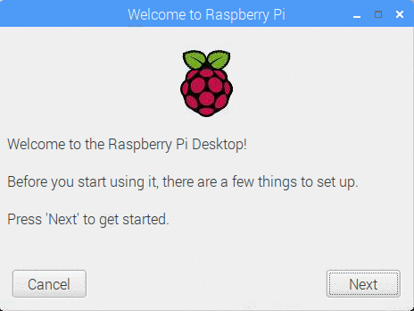

## سیٹ اپ ختم کریں

جب آپ پہلی بار اپنے ریکسیری پیئ شروع کرتے ہیں تو، **راسبری پی آئی** درخواست پر خوش آمدید پاپ اپ اور ابتدائی سیٹ اپ کے ذریعہ آپ کی رہنمائی کرے گی.

+ سیٹ اپ شروع کرنے کے لئے **اگلا** پر کلک کریں.

+ اپنا **ملک**، **زبان**، اور **ٹائم زون**، پھر **اگلا** دوبارہ دوبارہ کریں.

+ آپ رسبری PI لئے ایک نیا پاس ورڈ درج کریں اور کلک کریں **اگلا**.

+ اس کا نام منتخب کریں، پاسورڈ درج کریں اور **اگلا**پر کلک کرکے اپنے وائی فائی نیٹ ورک سے رابطہ قائم کریں.

**نوٹ:** اگر آپ کی رسبری پی آئی ماڈل میں وائرلیس کنیکٹوٹی نہیں ہے تو، آپ اس اسکرین کو نہیں دیکھیں گے.

+ کلک کریں **اگلا** Raspbian کو اپ ڈیٹس کے لئے وزرڈ چیک کرتے ہیں اور ان کو انسٹال (یہ تھوڑا وقت لگ سکتا ہے).

+ کلک کریں **دکھانا** یا **پھر بوٹ کریں** کے سیٹ اپ کو ختم کرنے کے لئے.

**نوٹ:** آپ کو ریبٹ کرنے کی ضرورت ہوگی اگر اسے اپ ڈیٹ مکمل کرنا ضروری ہے.

