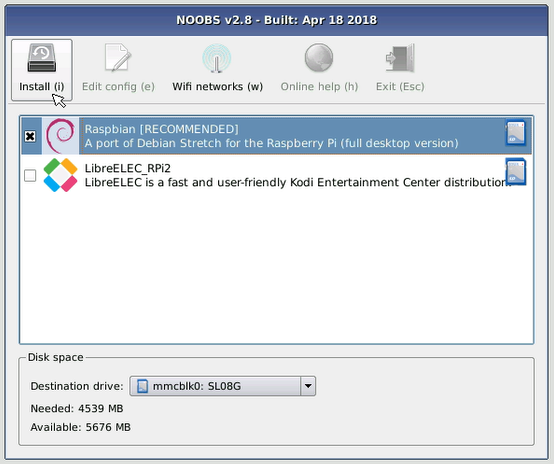

## Khởi động Raspberry Pi của bạn

Raspberry Pi của bạn không có công tắc nguồn: ngay sau khi bạn kết nối nó với ổ cắm điện, nó sẽ bật. Lưu ý rằng cổng nguồn micro USB của Pi có mặt phẳng dài hơn ở trên cùng.

+ Cắm nguồn điện micro USB vào ổ cắm và kết nối nó với cổng nguồn của Pi.

Bạn sẽ thấy đèn LED màu đỏ sáng lên trên Raspberry Pi, cho biết rằng Pi được kết nối với nguồn. Khi nó khởi động (điều này cũng được gọi là **khởi động**), bạn sẽ thấy quả mâm xôi xuất hiện ở phía trên bên trái của màn hình của bạn.

<video width="800" height="600" controls> <source src="images/piboot.webm" type="video/webm"> Trình duyệt của bạn không hỗ trợ video WebM, vì vậy hãy thử FireFox hoặc Chrome. </video> 

\--- sự sụp đổ \---

* * *

## title: Khởi động lần đầu với NOOBS

Nếu đây là lần đầu tiên bạn khởi động Raspberry Pi với thẻ SD chứa NOOBS, bạn sẽ thấy trình cài đặt NOOBS. Phần mềm này sẽ hướng dẫn bạn cài đặt hệ điều hành Raspbian (OS).

+ Khi trình cài đặt đã được tải, nó sẽ cung cấp cho bạn lựa chọn hệ điều hành nào để cài đặt. Chọn hộp cho **Raspbian**, rồi bấm **Cài đặt**.

+ Nhấp vào **Có** trong hộp thoại cảnh báo, sau đó ngồi lại và thư giãn. Quá trình cài đặt Raspbian sẽ mất một chút thời gian.

+ Khi Raspbian đã được cài đặt, nhấp vào **OK**. Raspberry Pi của bạn sẽ khởi động lại, và Raspbian sau đó sẽ khởi động.

\--- /sự sụp đổ \---

Sau một vài giây, Raspbian Desktop sẽ xuất hiện.

