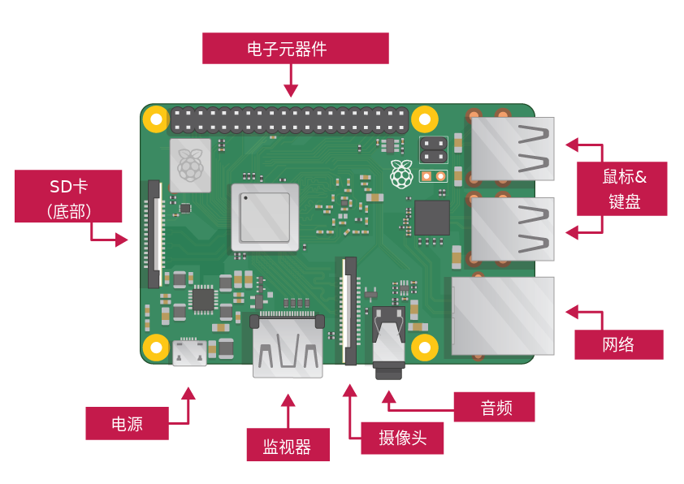

## 连接你的树莓派

让我们把一切都联系起来。 以正确的顺序执行此操作非常重要，这样您的所有组件都是安全的。

+ 将您使用Raspbian设置的SD卡（通过NOOBS）插入Pi底部的micro SD卡插槽中。 

**注意：** 个较大的适配器内有许多微型SD卡 - 您可以使用底部的唇缘将卡滑出。

+ 找到鼠标的USB线，并将鼠标连接到Raspberry Pi上的USB端口（无论哪个都无关紧要）。

+ 以相同的方式连接键盘。

+ 看看Raspberry Pi上的HDMI端口 - 请注意它顶部有一个大而扁平的侧面。

+ 确保您的屏幕已插入墙壁插座并打开。 使用电缆将屏幕连接到Pi的HDMI端口 - 如有必要，请使用适配器。

**注意：** 屏幕上不显示任何内容，因为Pi尚未运行。

+ 如果要通过以太网将Pi连接到Internet，请使用以太网电缆将Raspberry Pi上的以太网端口连接到墙上或Internet路由器上的以太网插槽。 如果您要使用WiFi或者您不想连接到互联网，则无需执行此操作。

+ 如果有扬声器，声音将来自您的屏幕，或者如果您有耳机或扬声器，则可以将它们连接到音频插孔。

