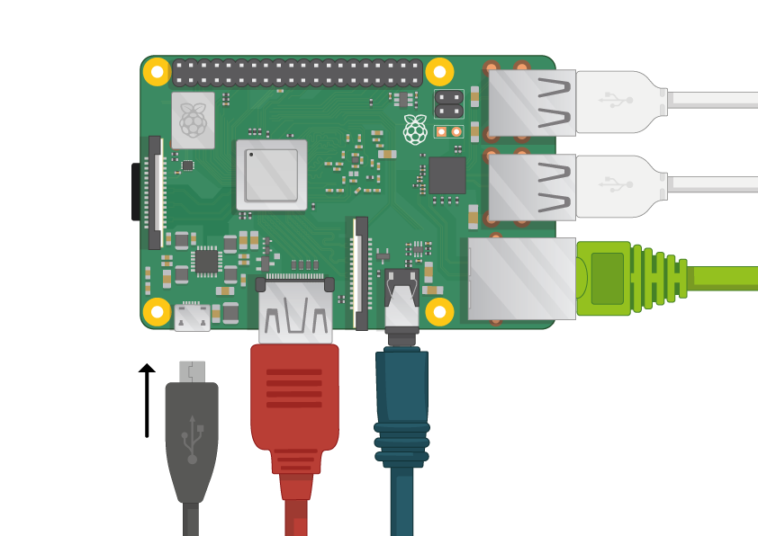
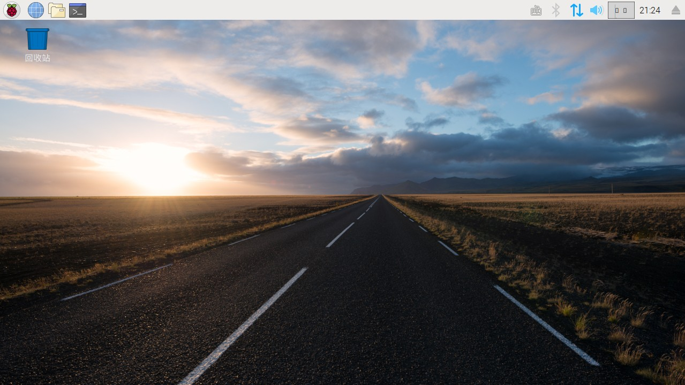

## 启动你的树莓派

您的树莓派没有电源开关：只要将其连接到电源插座，它就会开机。 请注意，Pi的micro USB电源端口顶部有较长的扁平侧面。

+ 将Micro USB电源插入插座并将其连接到Pi的电源接口。

您应该看到树莓派上的红色LED亮起，表示Pi已连接到电源。 当它启动时（这也称为 **引导**），您将看到树莓出现在屏幕的左上角。

<video width="800" height="600" controls> <source src="images/piboot.webm" type="video/webm"> 您的浏览器不支持WebM视频，因此请尝试使用FireFox或Chrome。 </video> 

\--- collapse \---

* * *

## 标题：NOOBS首次启动

如果这是您第一次使用包含NOOBS的SD卡启动树莓派，您将看到NOOBS安装程序。 该软件将引导您安装Raspbian操作系统（OS）。

+ 安装程序加载后，它将让你选择安装哪个操作系统。 选中 **Raspbian**的复选框，然后单击 **安装**。

+ 在警告对话框中单击 **是** ，然后就可以坐着放松会了。 Raspbian安装过程需要一些时间。

+ 安装Raspbian后，单击 **确定**。 您的树莓派将重新启动，然后Raspbian将启动。

\--- /collapse \---

几秒钟后，Raspbian 桌面将出现。

