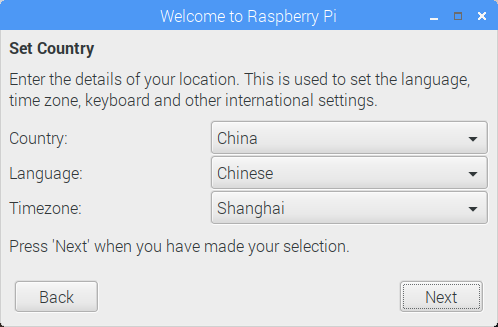

## 完成设置

当您第一次启动Raspberry Pi时，将弹出 **欢迎使用Raspberry Pi** 应用程序并引导您完成初始设置。

+ 单击 **下一步** 开始设置。

+ 设置您的 **国家**， **语言**和 **时区**，然后单击 **下一步** 一次。

+ 输入Raspberry Pi的新密码，然后单击 **下一步**。

+ 选择名称，输入密码，然后点击连接到WiFi网络 **下一页**。

**注意：** 如果您的Raspberry Pi型号没有无线连接，您将看不到此屏幕。

+ 单击 **下一步** 让向导检查Raspbian的更新并安装它们（这可能需要一段时间）。

+ 单击 **完成** 或 **重新启动** 以完成设置。

**注意：** 如果需要完成更新，您只需要重新启动。

