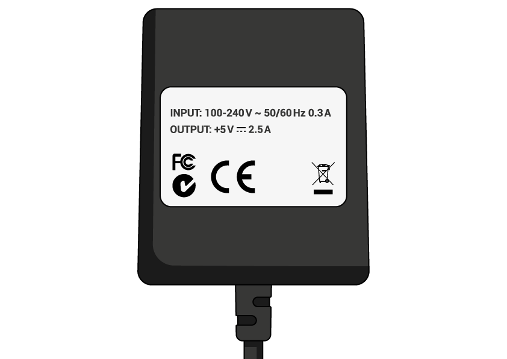

## 你需要什麼

### 哪個Raspberry Pi？

有幾個 [模式樹莓派的](https://www.raspberrypi.org/products/)，和大多數人的樹莓派3模型B +是一個選擇。

Raspberry Pi 3 Model B +是最新，最快，最容易使用的。

Raspberry Pi Zero和Zero W體積更小，功耗更低，因此它們對機器人等便攜式項目非常有用。 使用Raspberry Pi 3開始項目通常更容易，當你有一個小型Pi可用的工作原型時，移動到Pi Zero。

如果您想購買Raspberry Pi，請前往 [rpf.io/products](https://rpf.io/products)。

### 電源

為了連接電源插座，Raspberry Pi有一個微型USB端口（與許多手機上的相同）。

您將需要一個至少提供2.5安培的電源。 我們建議使用 [官方Raspberry Pi電源](https://www.raspberrypi.org/products/raspberry-pi-universal-power-supply/)。

### 微型SD卡

您的Raspberry Pi需要一張SD卡來存儲其所有文件和Raspbian操作系統。

您將需要一個容量至少為8 GB的micro SD卡。

許多賣家為Raspberry Pi提供SD卡，這些卡已經與Raspbian一起設置並準備好了。

### 鍵盤和鼠標

要開始使用Raspberry，您需要一個USB鍵盤和一個USB鼠標。

一旦你設置了Pi，就可以使用藍牙鍵盤和鼠標，但是你需要一個USB鍵盤和鼠標進行設置。

### 電視或電腦屏幕

要查看Raspbian桌面環境，您需要一個屏幕和一條電纜來鏈接屏幕和Pi。 屏幕可以是電視或計算機顯示器。 如果屏幕有內置揚聲器，Pi將能夠使用它們播放聲音。

#### HDMI

Raspberry Pi具有HDMI輸出端口，可與大多數現代電視和計算機顯示器的HDMI端口兼容。 許多計算機顯示器也可能具有DVI或VGA端口。

#### DVI

如果您的屏幕有DVI端口，您可以使用HDMI轉DVI電纜將Pi連接到它。

#### VGA

有些屏幕只有VGA端口。

要將Pi連接到此類屏幕，您可以使用HDMI-to-VGA適配器。

### 可選的附加功能

#### 一個案例

你可能想把Raspberry Pi放在一個盒子裡。 這不是必需的，但它會為你的Pi提供保護。 如果您願意，可以使用 [Raspberry Pi 3](https://www.raspberrypi.org/products/raspberry-pi-3-case/) 或 [Pi Zero或Zero W](https://www.raspberrypi.org/products/raspberry-pi-zero-case/)的官方案例。

#### 耳機或揚聲器

大型Raspberry Pi型號（不是Pi Zero / Zero W）具有標準音頻端口，就像智能​​手機或MP3播放器上的那樣。 如果您願意，可以連接耳機或揚聲器，以便Pi可以播放聲音。 如果您正在連接Pi的屏幕具有內置揚聲器，則Pi可以通過這些播放聲音。

#### 以太網電纜

大型Raspberry Pi型號（不是Pi Zero / Zero W）具有標準以太網端口，可將它們連接到互聯網。 要將Pi Zero連接到互聯網，您需要一個USB轉以太網適配器。 Raspberry Pi 3和Pi Zero W也可以無線連接到網絡。