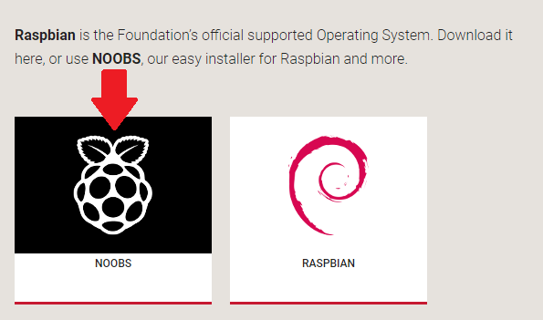

## 設置SD卡

如果您的SD卡上還沒有Raspbian操作系統，或者您想要重置Raspberry Pi，您可以自己輕鬆安裝Raspbian。 為此，您需要一台具有SD卡端口的計算機 - 大多數筆記本電腦和台式計算機都有一個。

### Rasopbian操作系統通過NOOBS

使用NOOBS軟件是在SD卡上安裝Raspbian的最簡單方法。

#### 下載NOOBS

+ 訪問 [Raspberry Pi下載頁面](https://www.raspberrypi.org/downloads)。

+ 您應該看到一個鏈接到NOOBS文件的框。 單擊該框。

+ 最簡單的選擇是下載文件的zip存檔。 請務必注意保存存檔的位置，以便您可以快速找到它。

#### 格式化SD卡

存儲在SD卡上的任何內容都將在格式化過程中被覆蓋。 因此，如果您要安裝Raspbian的SD卡上當前有任何文件，例如來自較舊版本的Raspbian，您可能希望先備份這些文件，以免永久丟失它們。

+ 訪問SD Association的網站，下載適用於Windows或Mac的 [SD Formatter 4.0](https://www.sdcard.org/downloads/formatter_4/index.html)。

+ 按照說明安裝軟件。

+ 將SD卡插入計算機或筆記本電腦的SD卡插槽，並記下分配給它的驅動器號，例如 `F：/`。

+ 在SD Formatter中，選擇SD卡的驅動器號以及卡的格式。

#### 從zip存檔中提取NOOBS

接下來，您需要從Raspberry Pi網站下載的NOOBS zip存檔中提取文件。

+ 查找下載的存檔 - 默認情況下，它應位於您的 `下載` 文件夾中。

+ 雙擊它以提取文件，並保持生成的Explorer / Finder窗口打開。

#### 複製文件

+ 現在打開另一個Explorer / Finder窗口並導航到SD卡。 最好將兩個窗口並排放置。

+ 選擇 `NOOBS` 文件夾中的所有文件，然後將它們拖到SD卡窗口中，將它們複製到卡上。

+ 文件全部複製完畢後，即可彈出SD卡。