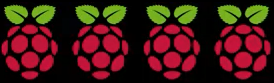

## 啟動你的Raspberry Pi

您的Raspberry Pi沒有電源開關：只要將其連接到電源插座，它就會打開。 請注意，Pi的micro USB電源端口頂部有較長的扁平側面。

+ 將微型USB電源插入插座並將其連接到Pi的電源端口。

您應該看到Raspberry Pi上的紅色LED亮起，表示Pi已連接到電源。 當它啟動時（這也稱為 **啟動**），您將看到覆盆子出現在屏幕的左上角。

<video width="800" height="600" controls> <source src="images/piboot.webm" type="video/webm"> 您的瀏覽器不支持WebM視頻，因此請嘗試使用FireFox或Chrome。 </video> 

- - 坍方 - -

* * *

## 標題：NOOBS首次啟動

如果這是您第一次使用包含NOOBS的SD卡啟動Raspberry Pi，您將看到NOOBS安裝程序。 該軟件將指導您安裝Raspbian操作系統（OS）。

+ 安裝程序加載後，它將為您提供安裝操作系統的選擇。 選中 **Raspbian**的複選框，然後單擊 **安裝**。

+ 在警告對話框中單擊 **是** ，然後高枕無憂。 Raspbian安裝過程需要一些時間。

+ 安裝Raspbian後，單擊 **確定**。 您的Raspberry Pi將重新啟動，然後Raspbian將啟動。

- - /坍方 - -

幾秒鐘後，Raspbian Desktop將出現。

